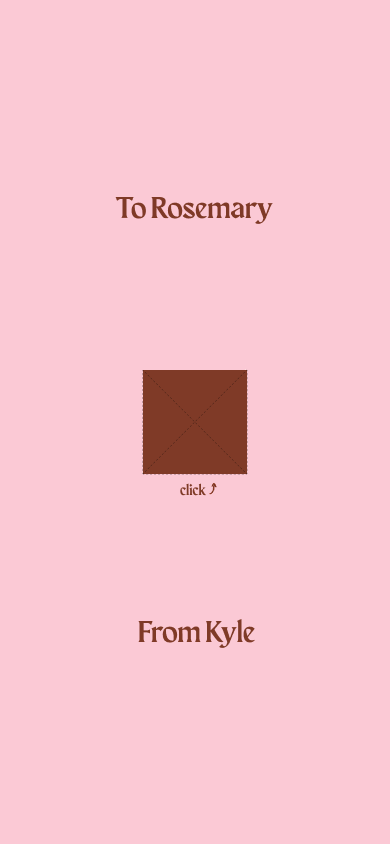

# 💕 Origami Valentine

A beautiful, interactive Valentine's Day web app featuring an animated origami card that unfolds to reveal a special message. Create personalized valentines and share them with your loved ones!



## ✨ Features

- **Personalized Cards** - Add sender and receiver names for a personal touch
- **Animated Origami** - Beautiful unfolding animation sequence
- **Interactive Response** - Recipients can say "Yes" or "No" to the valentine
- **Save the Date** - Reminder screen with February 14th highlighted
- **Share Anywhere** - Web Share API with clipboard fallback
- **Fully Accessible** - Keyboard navigation, screen reader support, reduced motion
- **Mobile First** - Responsive design optimized for all devices

## 🎯 User Flow

```
Sender: Create Card → Share Link
                ↓
Receiver: Open Link → Watch Origami Unfold → Answer Yes/No
                ↓
Yes → "I love you!" → Save the Date → Share Confirmation
No → "Try Again" → Back to Card
```

## 🛠️ Tech Stack

- **Framework:** React 19 + Vite
- **Styling:** Tailwind CSS
- **Animations:** Framer Motion
- **Routing:** React Router DOM
- **Icons:** Solar Icons

## 🎨 Design System

| Element | Value |
|---------|-------|
| Background | `#FBC9D5` (Pink) |
| Primary | `#7F3A27` (Brown) |
| Accent | `#C92A46` (Red) |
| Display Font | Maragsa |
| Body Font | Inter |
| Script Font | Luxurious Script |

## 🚀 Getting Started

### Prerequisites
- Node.js 18+
- npm or yarn

### Installation

```bash
# Clone the repository
git clone https://github.com/KoliOyama/origami_valentine.git

# Navigate to project
cd origami_valentine

# Install dependencies
npm install

# Start development server
npm run dev
```

### Build for Production

```bash
npm run build
```

Output will be in the `dist/` folder.

## 📁 Project Structure

```
src/
├── assets/
│   ├── designs/        # Design references
│   ├── fonts/          # Maragsa font
│   └── origmai_parts/  # Animation frames
├── components/
│   ├── AnimatedText.jsx
│   ├── Button.jsx
│   ├── HomeScreen.jsx
│   ├── InputField.jsx
│   ├── InvitationForm.jsx
│   ├── NoScreen.jsx
│   ├── NotFound.jsx
│   ├── OrigamiCard.jsx
│   ├── PageContainer.jsx
│   ├── ReminderScreen.jsx
│   ├── RequireParams.jsx
│   ├── ShareScreen.jsx
│   └── YesScreen.jsx
├── App.jsx
├── main.jsx
└── index.css
```

## 🌐 Deployment

### Vercel (Recommended)

1. Push to GitHub
2. Import project at [vercel.com/new](https://vercel.com/new)
3. Deploy!

The `vercel.json` is pre-configured for SPA routing.

### Netlify

Drag and drop the `dist/` folder at [app.netlify.com/drop](https://app.netlify.com/drop)

The `_redirects` file is included for SPA routing.

## ♿ Accessibility

- Keyboard navigation (Tab, Enter, Space)
- Keyboard shortcuts (Y/N keys on opened card)
- Screen reader announcements
- Reduced motion support
- Focus indicators
- Semantic HTML

## 🎨 Credits & Attribution

This project was inspired by the beautiful work of others:

- **Original Design Inspiration:** [Joie Lim's Origami Valentine Card](https://www.figma.com/community/file/1469358919281485466) - The origami card design and prototype concept, licensed under [CC BY 4.0](https://creativecommons.org/licenses/by/4.0/)
- **Design Origin:** Victorian Origami Card Puzzle from Pinterest, which inspired Joie Lim's interpretation
- **My Contributions:** Recreated origami artwork, added new screens (Yes/No responses, Reminder screen), animations, and full web implementation

Per the [Creative Commons Attribution 4.0 International License](https://creativecommons.org/licenses/by/4.0/), this project gives appropriate credit to the original designer while building upon and transforming the work.

## 📄 License

MIT License - feel free to use this for your own Valentine!

The design elements are adapted from work licensed under [CC BY 4.0](https://creativecommons.org/licenses/by/4.0/).

## 💝 Made with Love

Created for Valentine's Day 2026 by [Koli Oyama](https://linktr.ee/kolioyama). Spread the love! 💕
